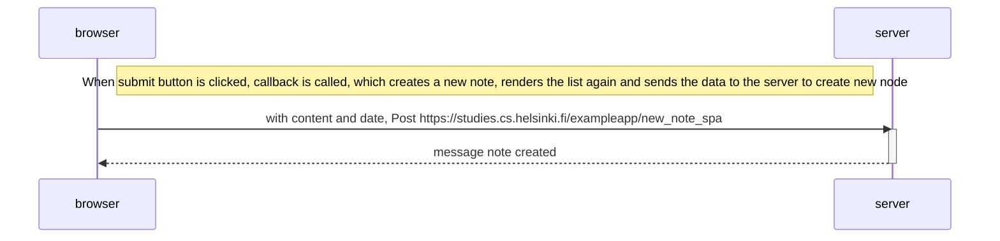

```mermaid
sequenceDiagram
    participant browser
    participant server

    Note right of browser: When submit button is clicked, callback is called, which creates a new note, renders the list again and sends the data to the server to create new node
    
    browser->>server: with content and date, Post https://studies.cs.helsinki.fi/exampleapp/new_note_spa
    activate server
    server-->>browser: message note created
    deactivate server

```    
